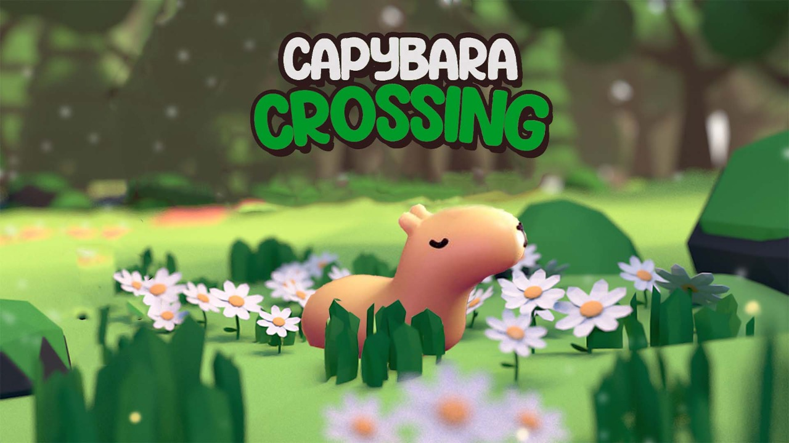

# Capybara Crossing

The fire is coming, it's time to run!
Capybara Crossing is a casual game for mobiles.

Run from the fire in Buenos Aires, Argentina, being a cute little capybara or a guinea pig. 

Swipe or tap to move forward, swipe sideways to dodge obstacles. Try to jump into the power ups to gain powers such as teleporting, freezing and much more!

Compete with your friends for the highest score!

Capybara Crossing is an exciting endless running game. Play it alone or against someone else.
Achieve your goal by dodging obstacles or using objects that can help you overcome difficulties... or generate new ones.
Run in an environment full of color and joy.
How far can your capybara run?

Capybara Crossing Features: 
◉ Entertaining game 
◉ Local multiplayer 
◉ Beautiful handcrafted 3D graphics 
◉ Endless fun with capybaras and guinea pigs 
◉ Optimization for all screens

This is a game being developed by students from <a href="https://www.imagecampus.edu.ar/">Image Campus</a>

   

## Credits

- **Francisco Cavenaghi** - *Developer*
- **Matías Galarza** - *Developer*
- **Juan Brutti** - *2D / 3D Artist*
- **Rocío Gimenez** - *2D / 3D Artist*
- **Aldo Di Paolo** - *Music Composer*
- **Emiliano Leonel López** - *SFX Implementator*
- **Diego Pablo Acosta** - *QA-Poc*
- **Andres Corvetto** - *QA Reviewer*
- **M. Paula Barbalace** - *QA Tester*

This game was also possible thanks to the support of these professors:

- **Sergio Baretto**
- **Ramiro Cabrera**
- **Ignacio Mosconi**
- **Lucía Inés Patetta**
- **Nazareno Rivero**
- **Eugenio Taboada**

## Acknowledgements

- **Ramón Bunge**
- **Juan Cruz Tourret**
- **Nicolás Jimenez Lamberti**
- **Federico Olivé**

## Links

Download it from itch.io: https://lobinux.itch.io/capybara-crossing
